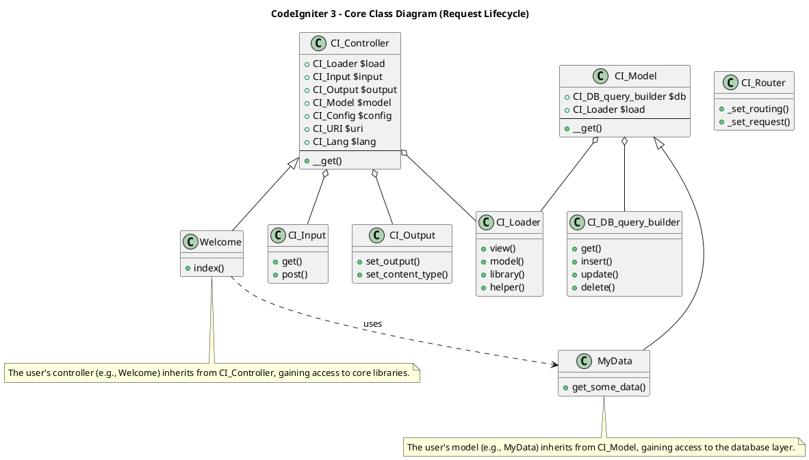

```plantuml
@startuml
title CodeIgniter 3 - Core Class Diagram (Request Lifecycle)

class CI_Controller {
  + CI_Loader $load
  + CI_Input $input
  + CI_Output $output
  + CI_Model $model
  + CI_Config $config
  + CI_URI $uri
  + CI_Lang $lang
  --
  + __get()
}

class CI_Model {
  + CI_DB_query_builder $db
  + CI_Loader $load
  --
  + __get()
}

class CI_Loader {
  + view()
  + model()
  + library()
  + helper()
}

class CI_Input {
  + get()
  + post()
}

class CI_Output {
  + set_output()
  + set_content_type()
}

class CI_Router {
  + _set_routing()
  + _set_request()
}

class CI_DB_query_builder {
  + get()
  + insert()
  + update()
  + delete()
}

class Welcome extends CI_Controller {
  + index()
}

class MyData extends CI_Model {
  + get_some_data()
}

Welcome ..> MyData : uses
CI_Controller o-- CI_Loader
CI_Controller o-- CI_Input
CI_Controller o-- CI_Output
CI_Model o-- CI_DB_query_builder
CI_Model o-- CI_Loader

note "The user's controller (e.g., Welcome) inherits from CI_Controller, gaining access to core libraries." as N1
Welcome .. N1

note "The user's model (e.g., MyData) inherits from CI_Model, gaining access to the database layer." as N2
MyData .. N2

@enduml
```
