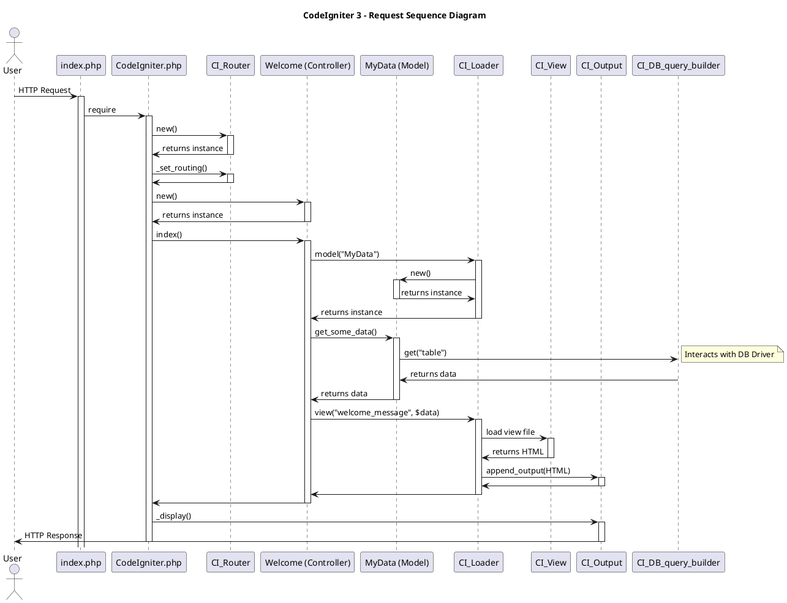

```plantuml
@startuml
title CodeIgniter 3 - Request Sequence Diagram

actor User
participant "index.php" as Index
participant "CodeIgniter.php" as CI
participant "CI_Router" as Router
participant "Welcome (Controller)" as Controller
participant "MyData (Model)" as Model
participant "CI_Loader" as Loader
participant "CI_View" as View
participant "CI_Output" as Output

User -> Index : HTTP Request
activate Index

Index -> CI : require
activate CI

CI -> Router : new()
activate Router
Router -> CI : returns instance
deactivate Router

CI -> Router : _set_routing()
activate Router
Router -> CI
deactivate Router

CI -> Controller : new()
activate Controller
Controller -> CI : returns instance
deactivate Controller

CI -> Controller : index()
activate Controller

Controller -> Loader : model("MyData")
activate Loader
Loader -> Model : new()
activate Model
Model -> Loader : returns instance
deactivate Model
Loader -> Controller : returns instance
deactivate Loader

Controller -> Model : get_some_data()
activate Model
Model -> CI_DB_query_builder : get("table")
note right: Interacts with DB Driver
CI_DB_query_builder -> Model : returns data
Model -> Controller : returns data
deactivate Model

Controller -> Loader : view("welcome_message", $data)
activate Loader
Loader -> View : load view file
activate View
View -> Loader : returns HTML
deactivate View
Loader -> Output : append_output(HTML)
activate Output
Output -> Loader
deactivate Output
Loader -> Controller
deactivate Loader

Controller -> CI
deactivate Controller

CI -> Output : _display()
activate Output
Output -> User : HTTP Response
deactivate Output

deactivate CI

@enduml
```
